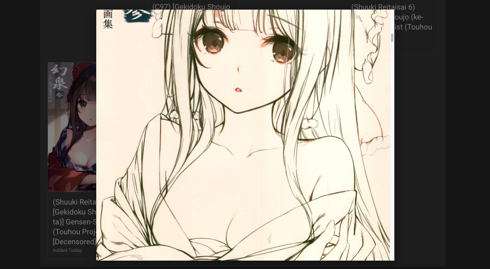

# DOUJIN_DL

## To Run

```shell
# go to http://localhost
docker compose up
```


<!--  -->


## Tech Stack

- Frontend
  - Material-UI
    - CSS Framework
  - Next.js
    - React + Static Site Gen
  - Redux
    - State management
  - React Final Form
    - Form validation and quality of life
- Backend
  - express
    - http webserver
  - node-fetch
    - making http requests
  - cheerio
    - parsing dom returned from http requests
- Nginx
  - Reverse Proxy
- Docker
  - Devops
- Typescript
  - Amazing.

## General Info

- Some doujins included for demonstration purposes
- Can manually put doujin folders in ./services/doujins/images
- Docker volumes passes that info on to the frontend public/images folder
