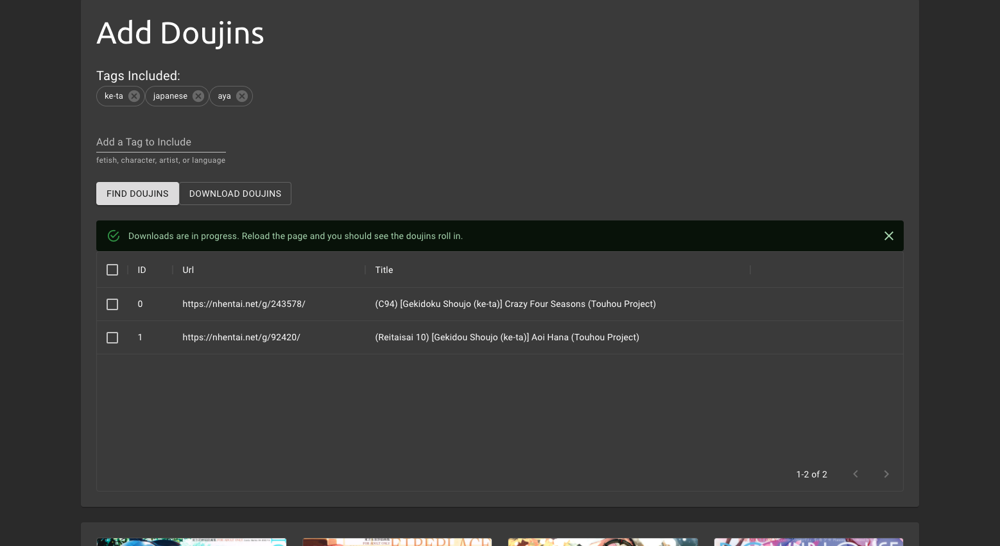
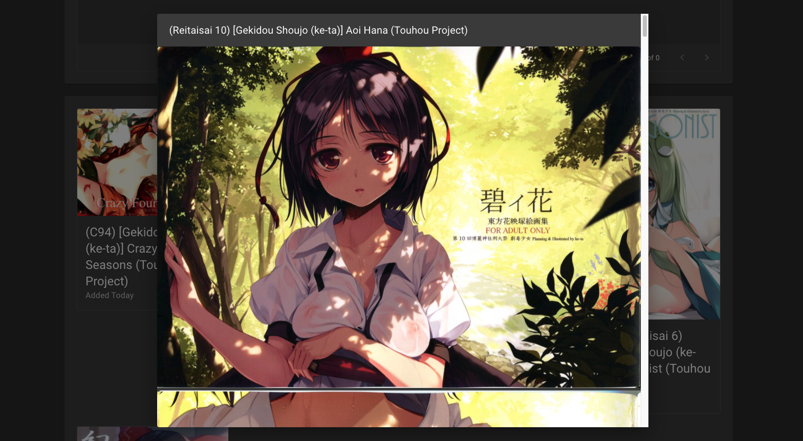

# DOUJIN COLLECTION

## To Run

```bash
# go to http://localhost
docker composse up
```




## Tech Stack

- Nginx
  - Reverse Proxy
- Frontend
  - Next.js
  - Redux
  - React Final Form
- Backend
  - express
  - node-fetch
  - cheerio
